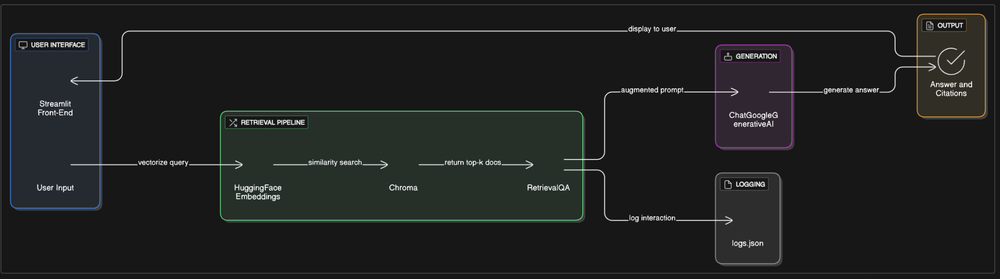

# Small AI App (RAG)

This project is a Retrieval-Augmented Generation (RAG) application that answers user questions based on a small, private document set. The application is built using a local vector database and a large language model (LLM) to ensure responses are factual and grounded in the provided documents.

## Project Goal

The primary goal of this project is to demonstrate the end-to-end RAG pipeline, from data ingestion to user interaction. It is designed to provide accurate, citable answers while gracefully handling questions that fall outside the scope of the document corpus.

## Core Stack

- **Framework**: Streamlit for a simple and effective user interface.
- **LLM Provider**: Google Gemini-1.5-Flash via `langchain-google-genai`.
- **Vector Store**: ChromaDB for storing and retrieving document embeddings.
- **Embeddings Model**: `sentence-transformers/all-MiniLM-L6-v2` (a local, lightweight model).
- **Orchestration**: LangChain for managing the RAG pipeline components.

## Architecture

The application follows a standard RAG pipeline architecture:

1.  **Ingestion (`ingest.py`)**: Documents are loaded from the `docs/` folder. They are then **chunked** to create smaller, manageable pieces of text. These chunks are converted into numerical representations called **embeddings**. Finally, the chunks and their embeddings are stored in a persistent **Chroma vector database**.
2.  **Retrieval & Generation (`app.py`)**: The Streamlit application takes a user's question. This question is converted into an embedding and used to search the Chroma database for the most relevant document chunks. These retrieved chunks, along with the original question, are "stuffed" into a prompt and sent to the LLM.
3.  **Output**: The LLM generates a comprehensive answer based on the provided context. The application then displays the answer along with **citations** from the original documents, providing transparency and verifiability.



## Design Choices & Justification

### Chunking Strategy

In the `ingest.py` script, we use a `RecursiveCharacterTextSplitter` with a `chunk_size` of `1000` characters and a `chunk_overlap` of `200`.

* **Why Recursive Splitting?**: This method is highly effective because it tries to split on logical boundaries (like double newlines, single newlines, spaces) first, which helps keep sentences and paragraphs intact, preserving semantic meaning.
* **Why 1000 characters?**: This size provides a good balance. It's large enough to contain sufficient context for the LLM to form a coherent answer but small enough to fit within the LLM's context window without being overly expensive or slow.
* **Why 200 character overlap?**: The overlap ensures that we don't lose crucial information that might be at the boundary between two chunks. It helps maintain continuity and improves the chances of retrieving all relevant information for a given query.

### "I don't know" Path

The LLM's prompt is explicitly designed to handle out-of-scope questions. It's instructed to respond with "I don't know" if the provided context does not contain the answer. This is a critical guardrail against **hallucination** and is tested via a sample out-of-scope query.

## How to Run the Project

Follow these steps to set up and run the application on your local machine.

### Prerequisites

-   Python 3.8 or higher
-   `pip` package manager

### Step 1: Clone the Repository

```bash
git clone <your_repo_link>
cd <your_repo_name>
```

### Step 2: Set up the Python Environment
First, install the required libraries.
Inside requirements.txt file

streamlit
langchain
langchain-community
langchain-google-genai
chromadb
pypdf
unstructured
unstructured-client
jq
jsonpath-ng
sentence-transformers
transformers

```bash
pip install -r requirements.txt
```

### Step 3: Add Your Documents
Place your PDF, JSON, or TXT files into the docs/ directory.

### Step 4: Configure Your API Key
Create a folder named .streamlit in your project's root directory. Inside that folder, create a file named secrets.toml. Add your Google API key to this file:

Ini, TOML

# .streamlit/secrets.toml
GOOGLE_API_KEY="YOUR_API_KEY_HERE"

### Step 5: Ingest the Documents
Run the ingest.py script to load, chunk, and index your documents into the vector database. This may take a few minutes depending on the number and size of your documents.

```bash
python ingest.py
```
You should see confirmation messages as the documents are processed and the chroma_db folder is created.

### Step 6: Run the Streamlit App
Finally, launch the application using Streamlit.

```bash
streamlit run app.py
```
The app will open in your default web browser.

### Known Issues & Limitations
Token Counting: The token counting function provides a rough estimate using a generic tokenizer. It is not an exact measure of the actual tokens used by the Gemini API, which has its own tokenization method.

No Multi-hop Reasoning: The current RAG setup is limited to single-step retrieval and summarization. It cannot perform multi-hop reasoning (e.g., answering "Who did the founder of company X work with at their previous job?" by retrieving information from two different documents).

No Query Rewriting: The model does not rewrite user queries before retrieval, which could sometimes improve results.

### What I'd Do with More Time
Implement Reranking: Add a reranking step after initial retrieval to improve the quality of the retrieved chunks. This would ensure the most relevant chunks are fed to the LLM.

Add a Simple Evaluation Suite: Create an 8-10 Q/A pair test set and automate a script to run queries and evaluate the model's accuracy. This would provide a quantifiable measure of performance.

Improve UI/UX: Add features like a chat history interface to maintain conversational context.

Explore Guardrails: Implement more sophisticated guardrails to protect against prompt injection or malicious queries.


***

